# RT-Thread-LVGL

The purpose of this project is to create a LCD display that takes a can message in and then shows the decocded data in a human readable format. This is accomplished by using RT-Thread RTOS with LVGL as the graphics library on an i.MX RT1060-EVK.

---
***NOTE***
Thank you to  RT-Thread, LVGL, NXP for sponsoring this event. It was great fun working on this project and I hope it is usefull. 

I was glad to be able to contribute to the project under PR https://github.com/RT-Thread/rt-thread/pull/6238#issuecomment-1207624765 which fixed an issue with inititialization of the touch controller out of power up.

---
This readme should function as a tutorial to provide a user with the following skills.
<ol>
<li>Setup and creating a project in RT-Thread Studio</li>
<li>Creating an Image in LVGL and loading it into RT-Thread</li> 
<li>How to implement NXP FLex CAN sdk drivers in RT-Thread</li> 
</ol>

# Videos
There are a few vidoes showing different aspects of this project. They are located below where they fit appropriately. They are also linked here for reference.

There is a video of the complete project on YouTube. You can see the final product taking CAN messages and updating LVGL gauges with that data.
https://www.youtube.com/embed/a3wtcvLzRa0

# BOM
## Hardware
<ul> 
<li>MIMXRT1060-EVKB</li>
<li>Rocktech LCD</li>
<li>USB<->CAN Adapter</li>
<li>0.1" Pitch Header, two pieces of wire, and a DB-9 Connector for CAN</li>
</ul>

This is a view of the LVGL project running under RT-Thread.

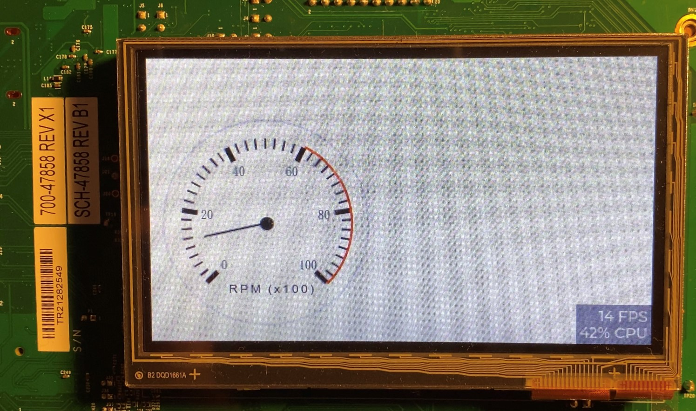

## Software
<ul>
    <li>RT-Thread Studio</li>
    <li>NXP GUI Guider</li>
</ul>

# Tutorial - Using LVGL with RT-Thread

The <b>RT-Thread_LVGL_Tutorial.odt</b> document contains a tutorial of how to setup the RT-Thread Studio Environment for developing LVGL applications on RT-Thread.

The code located in the <b> ContestTest</b> folder contains an exmaple project build with this tutorial.

# Installation
## Development Environment
Download and Installation RT-Thread Studio per the installation instructions.
[RT-Thread Studio](https://www.rt-thread.io/studio.html)

Install GUI Guider per installation instructions.    
[NXP GUI Guider](https://www.nxp.com/design/software/development-software/gui-guider:GUI-GUIDER)

# Setup
We will now setup the development environment and the hardware to be able to debug our application.
# Hardware

## Hardware Modifications
### Update J-Link for onboard debugging.

* Follow the instructions provided by NXP at to update the onboard debugger so that we can use J-Link servers.
[Modifying Debug Firmware on i.MX RT10xx Boards Featuring An LPC4322-based Debug Probe](https://www.nxp.com/docs/en/application-note/AN13206.pdf)

* The original debugger firmware enabled the power supply from the USB to provide power to the rest of the board. The update does not turn the power on. If you wish to use the USB Debugger to power the board you will also need to make this hardware modification.
Jump R97 with a 10k if you want to power the board from the Debugger using VUSB.

* CAN Bus connections require the population of _J42_ with a header or by soldering wires directly.

## Create an RT-Thread starter project
1. Download the latest RT-Thread code base from [Github](https://github.com/RT-Thread/rt-thread.git). The path to the rthread folder will be refered to as \<RT-THREAD\> for the rest of this document.

2. Create a starter project by following the RT-Thread RTOS — LVGL documentation 
a. Follow this section: [“Import a BSP project into RT-Thread Studio”](https://docs.lvgl.io/master/get-started/os/rt-thread.html#import-a-bsp-project-into-rt-thread-studio).
b. The path to the BSP is _\<RT-THREAD\>\bsp\imxrt\imxrt1060-nxp-evk\_

3. To import a project open the File->import->BSP project. This will open a window that shows something like this.
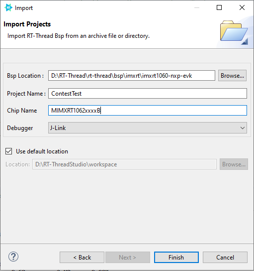

4. Now hit the Finish button to create the project.

5. If the project was successful you should now try to build the code.
If the build is successful you should see text in the console that looks something like this.
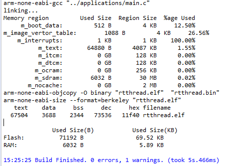

6. Let's try to debug the project to make sure that our system works.
a. In the toolbar select the debug configuration:
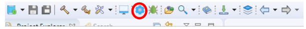

7. If this fails to launch confirm that you have the correct settings for the debugger and make sure you are using the latest Segger J-Link debugger.
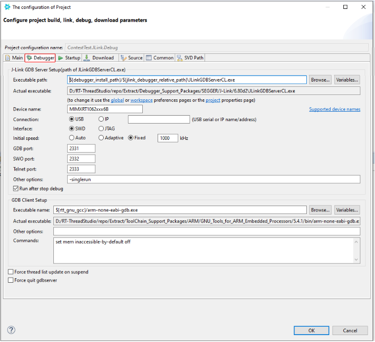

8. Plug a USB cable into the board using the Debug Port, marked J1 on my board.
9. Hit the debug button.
10. You may be asked to acknowledge the use of JLINK software. There is a checkbox at the bottom left that won’t ask again today. This box will timeout and report a failure on the debug console. If you have multiple monitors check the other ones to see if the pop-up window opened there.
11. If you get the following error message see step 7.
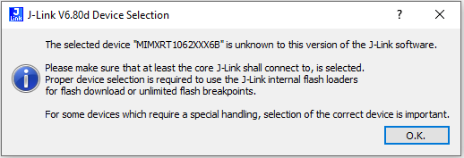

12. The current version of RT-Thread Studio is bundled with an older version of J-Link tools. Specifically version 6.80d. This version does not have the MCU I am using in it. To overcome this issue do the following.
a. [Segger J-Link Debug Tools](https://www.segger.com/downloads/jlink/)
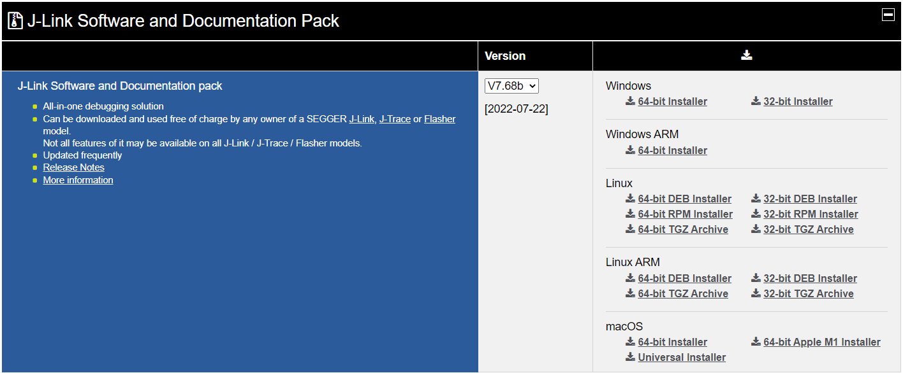
b. Download and install the version for your appropriate system.
c. Mine was _J-Link Version V7.66e_.
d. Take note of the install location as it is needed later for updating the configuration.
e. Once the install is complete update the J-Link executable settings in on the debug settings page.
f. Now update the path to the J-Link debugger.
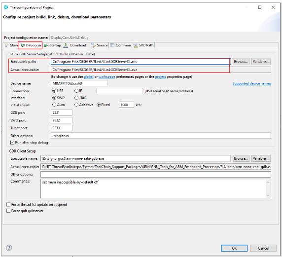
13. Once the connection of the debugger to the process is successful you should see a break point and the code is running. You will see a green highlight and an arrow on the left in of the window pane indication which instruction is the next to execute.
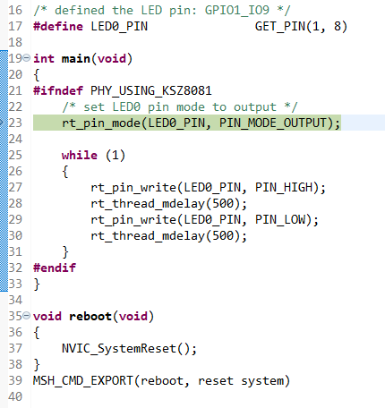

14. You can look up the debug controls as they are common, or hover the mouse over and a description will be displayed in a tooltip.
15. We are going to allow the processor to continue execution so that we can observe continuous execution.
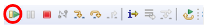

## Now let’s create an LVGL application

1. Open the “RT-Thread Settings” file.
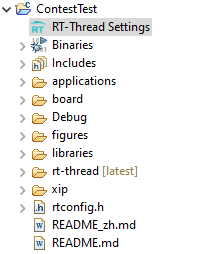

2. This will open the RT-Thread Soft Package Center page.
3. Select the back arrows “<<”
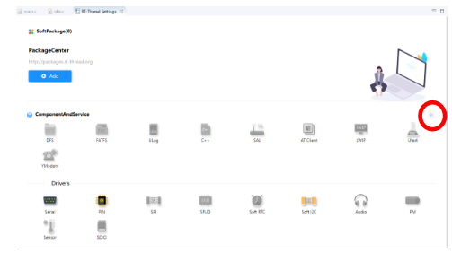

4. Select the “Hardware” tab on the next page.
a. Enable the items shown below. 
b. Confirm the display specifics are the same as in your GUI Guider project. 

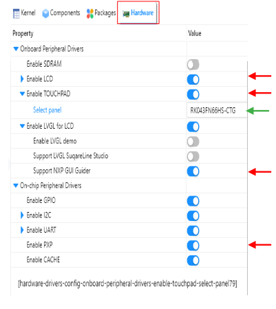
c. Select the “Packages” tab
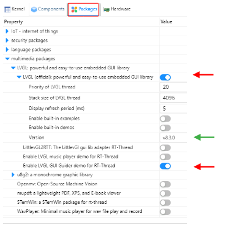

d. Select the “Enable LVGL GUI Guider demo for RT-Thread” 
1. Confirm that the Version of LVGL matches the same major version selected in Gui Guider. 

e. At this point build the application and then debug. To confirm that the code builds and we can use the display.

https://www.youtube.com/embed/27I1w731RW4

j. Now we need to create some gui code.

## Create a starter GUI Guider project

1. Download and Install the latest GUI guider from [here](http://www.nxp.com/)
2. Launch GUI Guider.
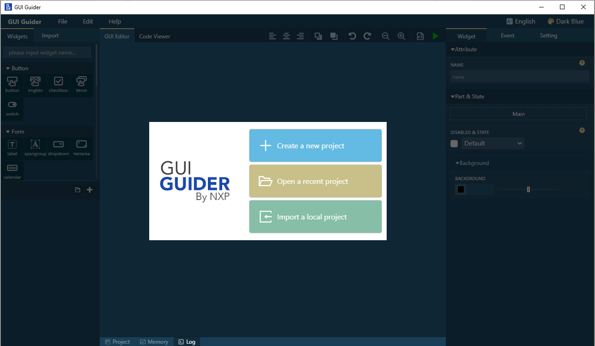

3. Select “Create a new project”

4. This will open a selection for which version of LVGL you would like to use in the project. We will use LVGL V8 for this tutorial.
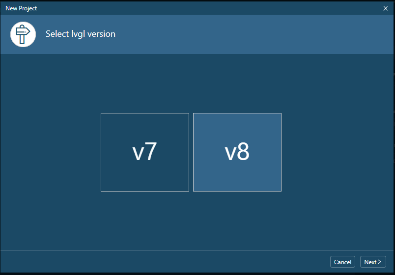

5. Select “Next”

6. This will open the “Select a Board Template” screen. Select “i.MX RT” tab at the top.
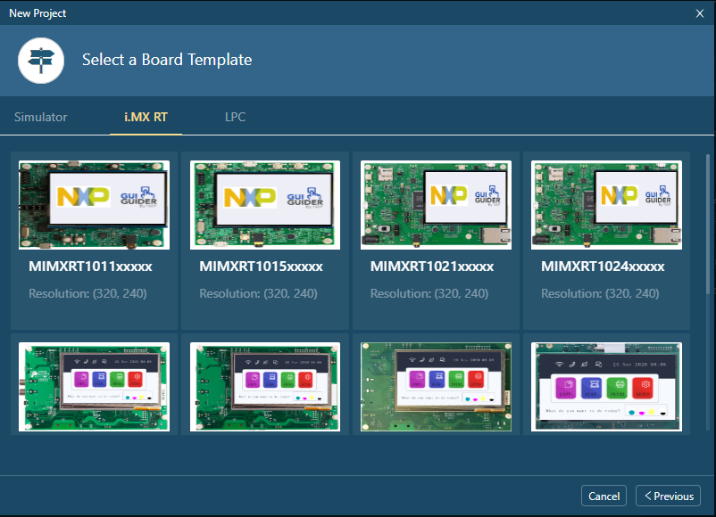

7. Select your board.
   1. The evaluation board I am using is a MIMXRT1060-EVKB with the details below.
   a. Processor is a MIMXRT1062DVL6B
   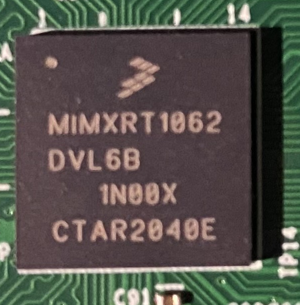
   b. Note this is a B type and we will need to account for that later when we want to debug the processor. We will need to update the JLINK configuration to tell the JLINKGDBServer which processor we want to debug.
   2. Screen is a RockTech Displays, RK043FN66HS-CTG
   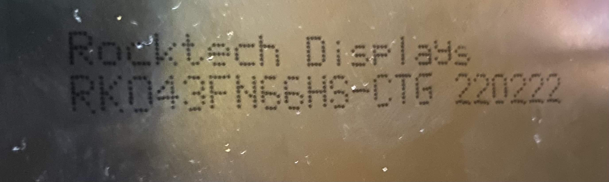
   3. So I will select the one highlighted below.
   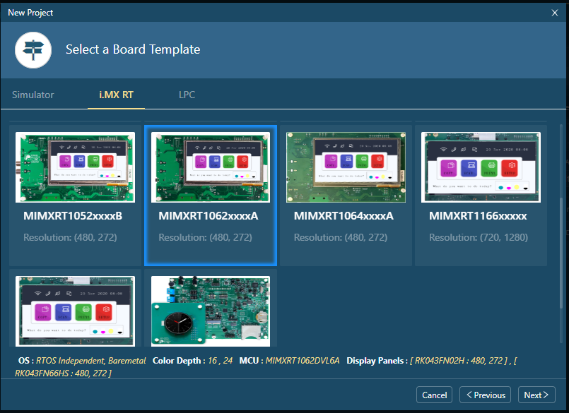
   **NOTE: This is not the exact processor that we will use. The one in the selection list is a MIMXRT1062xxxxA and the board I am using is a MIMXRT1062xxxxB. For this example though, this isn’t an issue. You will need to verify that everything works for YOUR particular application.
   4. I want a single page to add a couple of gauges so I will select the template below.
   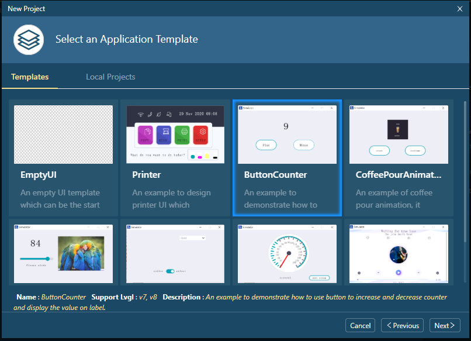
   5. This will bring up a summary screen with a few key final selections.
   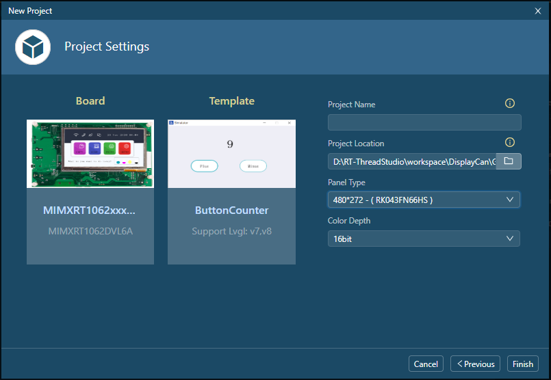
   6. Final Selections
      1. “Project Name” and “Project Location”
         1. Give your project a meaningful name, we will treating this as a separate project for now and only using the output files from GUI Guider. So put this project in a place where you can find it later.
      2. “Panel Type”
         1. Select the panel to match the one you have. I had to open the list and select mine from there. You could also specify a custom panel if you wanted.
   7. This completes the initial creation of the project. Now we can start adapting it to our needs.
   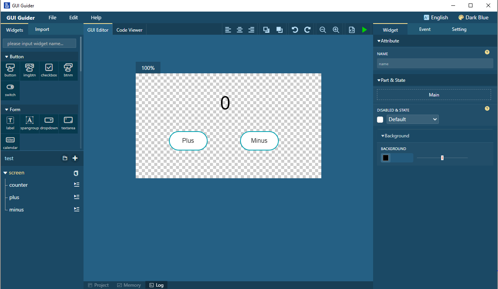

## Integrate the GUI Guider project into the RT-Thread Project
### Generate GUI Guider output files

1. In GUI Guider, Select the “Generate Files” button.
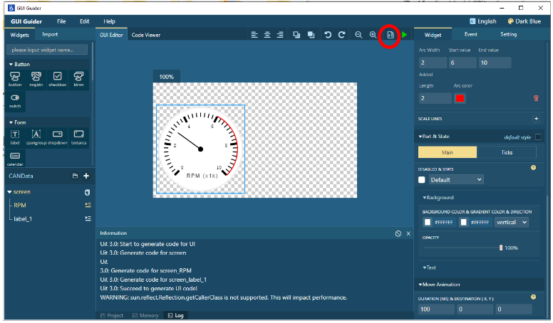
2. This will generate the C Code files necessary to create this image.
3. The output files are placed in the “generated” folder in the project path.
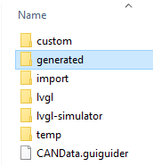
4. We need these files from that path.
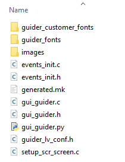
5. We will copy the contents of the “generated” folder to the RT-Thread project path.
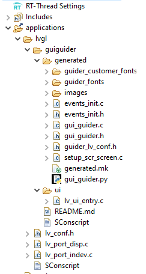
7. These files from the GUI Guider → Generated folder will be placed inside the applications folder and we will create a new “generated” folder like this
8. If a file in the generated folder fails to find “lvgl/lvgl.h” replace the path with “lvgl.h
9. Some files may need to have their paths resolved. There can be conflicts between the files. This may include the following.
a. To add a folder to the build sometimes means we must un-exclude it from the build.
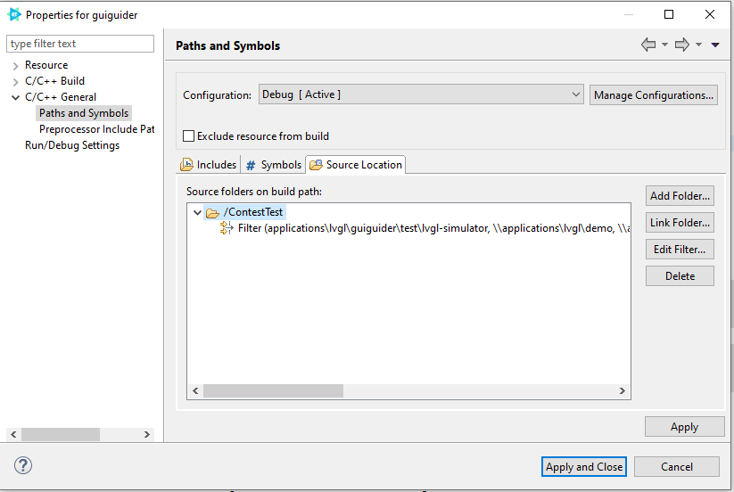
b. You also need to remove the package files from the include path.
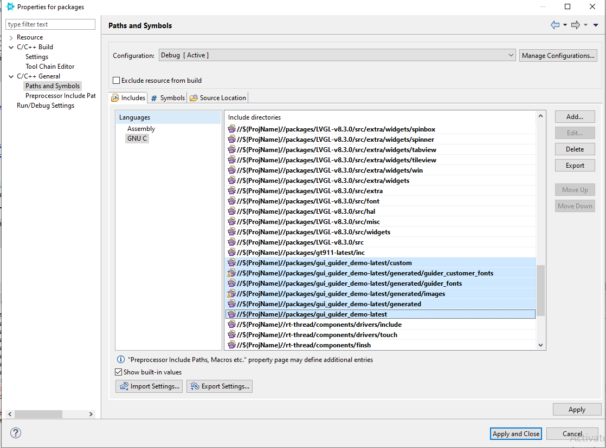
9. To enable the FSL CAN Drivers remove it from the exclusion list.
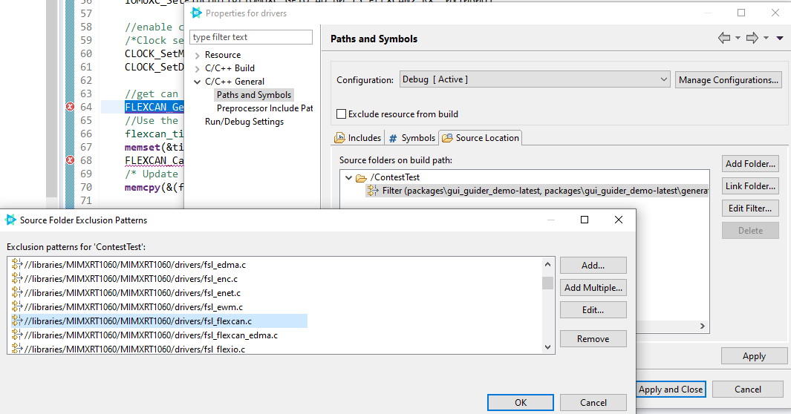
10. At this point we are able to create a LVGL project, include that code into an RT-Thread project, and use NXP based FSL driver code.

In the end you should have something that works like this!

https://www.youtube.com/embed/NIXyxk9k4Lg

Future work:
1. Enable PXP for hardware graphics acceleration.